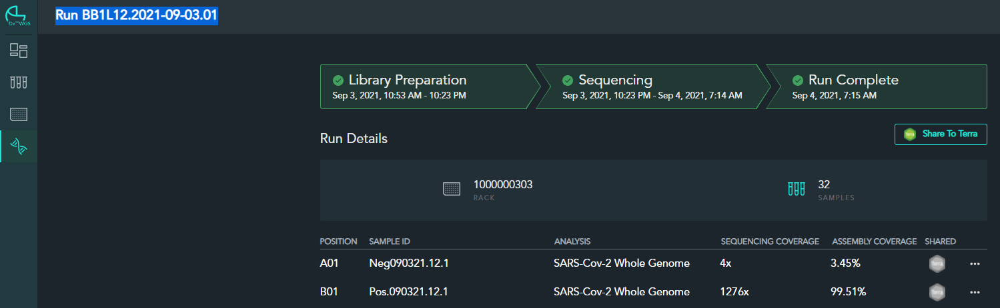
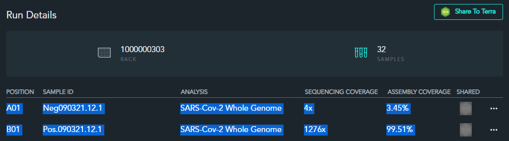

# Workflow 2 Script
_______________________________________

### Gathers run statistics from ClearLabs Website (as supplied by user), and pushes run statistics to main SQL database.

 
 

## How to use the Workflow 2 Script:

 

 - **Step 1**
   - Start the main script, and type `2` to enter the first step of the daily workflow script.
   - Alternatively, this script is called as the second step to the `start` command.

 

 - **Step 2**
   - Follow any prompts for the first time using the script.  Currently, no private data is gathered for this workflow.
   - Next, the script will ask the user to specify which platform the data is coming from.
     - **TO DATE:** only the 'c' (ClearLabs) option is functional
   - Next, the script will ask the user to copy the run id from ClearLabs.  To expedite this process, the easiest thing for the user to do is to navigate to the [clearlabs website](https://wgs.app.clearlabs.com/lab/dashboard/team) and navigate to the `Runs` page.  Select the run for which you'd like to import run data.  At the top, copy the full header, as shown below, and paste it into the script window:
     - 
   - Next, the script will ask the user to copy all the run data from ClearLabs.  From the same run page, the user should start at `A01` and click-drag to highlight all samples and information, and copy the information.  Then, the user should paste the data into the script window:
     - 
     - *Note: it is important that the user select all 32 samples in the Run Details page, as the script loops through information until data for 32 samples has been uploaded.*

 

 - **Step 3**
   - The script at this point collects all data input by the user and pushes it to the main SQL database.

 
 

## How the Workflow 2 Script works:

### I will split the logic up into the functions that the script calls from its helper file.

 

- **get_json()**
  - Loads data relevant for script into memory.
  - Requests additional information from user if first time using the script.
  - See description for how the get_json() call works to import relevant data for each script as it is called from the [workflow_obj](workflow_obj.md) doc.

 

- **get_info_from_user()**
   1) Prompt the user for type of run and run id of desired run to push to database
       - The script here simply checks to make sure the submitted value matches an expected value using [`regular expressions`](https://docs.python.org/3/library/re.html).
       - Additionally, the script scrapes important information from the run id and stores it, such as `machine_num`, `run_date`, and `day_run_num` to uniquely identify sample upload later.
   2) Prompt the user for all run data for the 32 samples
       - The script in this step is just running through a simple input loop, which must receive 224 inputs from the user (which should correspond exactly to 7 elements of run data each for 32 samples), and builds a dictionary from the inputs to match samples with their run stats.
   3) Evaluate whether or not the controls pass with the run statistics given from step 2.
   4) Create DataFrame from the run statistics dictionary

 

- **format_dataframe()**
  - Remove any samples with "pool" in the label
  - Remove any samples with "blank" in the label
  - Format columns appropriately.  Alters/creates:
    - `platform`
    - `machine_num`
    - `day_run_num`
    - `percent_cvg`
    - `avg_depth`
    - `wgs_run_date`
    - `pos_pass`
    - `neg_pass`
  - Sort columns

 

- **database_push()**
  - We only write to the `Results` table if the positive and negative controls pass.
  - We write to the `Run Data` table regardless of controls passing.
  - Push relevant DataFrame(s) to the database in this step.

