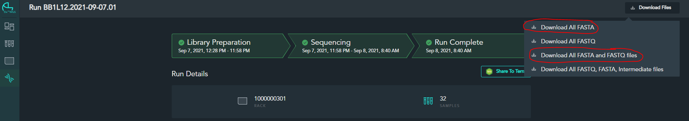

# Workflow 3 Script
_______________________________________

### Compiles a folder of `.fasta` files into a single file, and pushes paths to each sample's `.fasta` file to the main SQL database.

 
 

## How to use the Workflow 3 Script:

 

 - **Step 1**
   - Start the main script, and type `3` to enter the first step of the daily workflow script.
   - Alternatively, this script is called as the third step to the `start` command.

 

 - **Step 2**
   - Follow any prompts for the first time using the script.  Currently, no private data is gathered for this workflow.
   - For this step, the user should have already downloaded the `.fasta` files from the ClearLabs website using one of the two options below:
     - 
   - The user should also have extracted the downloaded files to a folder with the following structure: mmddyy.machine_num.day_run_num/FAST files/ (i.e. 090721.11.1/FAST files)
   - Next, the script will ask the user to specify the path to the folder which contains all of the downloaded `.fasta` files.  It will verify that the folder path ends with `Fast files`.
   - The script at this point runs through the folder, opening every file with a `.fasta` extention, and concatenates them into a single file named all_mmddyy_machine_num.fasta (i.e. all_090721_11.fasta), and saves the file in the parent folder (in the example above, the concatenated file will be in 090721.11.1/all_090721_11.fasta)

 
 

## How the Workflow 3 Script works:

### I will split the logic up into the functions that the script calls from its helper file.

 

- **get_json()**
  - Loads data relevant for script into memory.
  - Requests additional information from user if first time using the script.
  - See description for how the get_json() call works to import relevant data for each script as it is called from the [workflow_obj](workflow_obj.md) doc.

 

- **compile_fasta()**
   1) Prompt the user for location of folder containing all `.fasta` files to concatenate
       - The script here simply checks to make sure the selected path ends with `FAST files`
   2) Loop through folder, opening and copying every file with extension `.fasta` into new file, stored in the parent folder
       - The script in this step is just running through a simple input loop, which must receive 224 inputs from the user (which should correspond exactly to 7 elements of run data each for 32 samples), and builds a dictionary from the inputs to match samples with their run stats.
   3) If the analysis pathway set in the `private_cache.json` = 'cli', the script will return the path to the concatenated file.

 

- **get_fasta_path_df()**
  - Remove any samples with "pool" in the label
  - Remove any samples with "blank" in the label
  - Drops control rows of data
  - Format columns appropriately.  Alters/creates:
    - `hsn`
    - `machine_num_var`
    - `position`
    - `day_run_num_var`
    - `wgs_run_date_var`
    - `path_to_fasta`
  - Sort columns

 

- **database_push()**
  - We only write to the `Run_Stats` table in WF_3 Compile Fasta.
  - Push relevant DataFrame(s) to the database in this step.