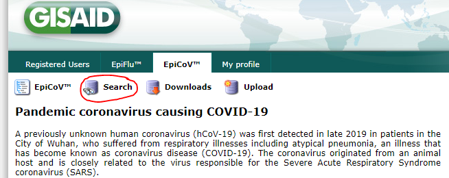

# EPI_ISL Importer
_______________________________________

### Fills in EPI_ISL numbers for past submissions to GISAID in the SQL database

 
 

## How to use the EPI_ISL script:

 

 - **Step 1**
   - Grab the EPI_ISL numbers from [GISAID](https://www.gisaid.org/)'s database (Follow the link)
   - Login
   - Click the 'Search' button at the top of the page:
   - 
   - Filter by your location (i.e. `North America / USA / Kansas`)
   - Check the select all box and click the 'Download' button
   - Select 'Patient status metadata'
   - Save the file in a memorable location

 

 - **Step 2**
   - Start the script, and type `epi isl` to enter the gisaid report generator script.

 

 - **Step 3**
   - Follow any prompts for the first time using the script.  Currently, no private data is gathered for this workflow.
   - Next, the script will ask the user to specify which platform the data is coming from.
   - The final prompt you will receive is to select the `.tsv` file downloaded from GISAID's website in step 1.

 

 - **Step 3**
   - The script at this point builds a DataFrame from the .tsv files, and matches GISAID numbers with EPI_ISL numbers, and finally pushes the pairs into the database.

 
 

## How the EPI_ISL script works:

### I will split the logic up into the functions that the script calls from its helper file.

 

- **get_json()**
  - Loads data relevant for script into memory.
  - Requests additional information from user if first time using the script.
  - See description for how the get_json() call works to import relevant data for each script as it is called from the [workflow_obj](workflow_obj.md) doc.

 

- **get_epi_isl_dfs()**
  - Ask user to select the `.tsv` file and read into pandas DataFrame
  - Create `gisaid_num` column, parsed from the `Virus name` workbook in the column.
  - Remove all columns except for `gisaid_num` and `epi_isl`.
  - Format `.tsv appropriately

 

- **database_push()**
  - We need to store the discovered epi_isl in the database, matched with the `gisaid_num`, so we push that data to the database in this step.

