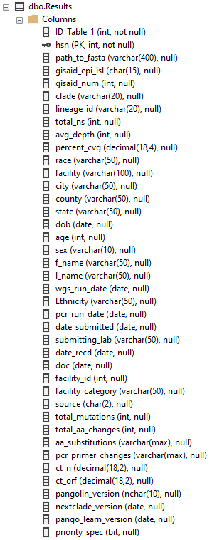

# Setting up an environment for this package
_________________________________________________________

### Will be working on allowing the package to work with less stringent file structures/environments

 
 

## Current Requirements

 

- Windows (only tested on 10)
- Python >= 3.9.1 (only tested with Miniconda)
- Required libraries for Python as listed in the requirements.txt file
- Git Bash
- Excel 2016 or higher

 

## Setting up the Git Environment

 

- Download the git bash terminal from [here](https://git-scm.com/downloads)
    - Install with recommended settings
- Right click in folder you'd like to contain the package, and click `git bash here`:
    - 
- Once the window is open, use the instructions to set up your gitHub profile/connect it to Git Bash.
- Next, type: `git clone https://github.com/jbarnell1/KHEL_WGS_SARS_CoV_2.git` 
    - Alternatively, paste with right click --> Paste
- The package should now appear in your folder, and you're set!

 

## Setting up the Python Environment (requires [Miniconda or Anaconda](https://docs.conda.io/en/latest/miniconda.html))

 

- **Virtual Environments coming soon!**
- After installation of Miniconda (make sure to add python to at least user-level PATH!!), navigate to the windows start menu, and enter the `Anaconda Prompt` by typing it in.
- `cd` to the `KHEL_WGS_SC2` package
- You will need to call the same command several times with small changes.  The general structure should be: `conda install -c conda-forge <package_name_here> -y` with the following package names:
  - [`git`](https://gitpython.readthedocs.io/en/stable/)
    - Used if scripting the git pull for the most recent changes
    - `conda install -c conda-forge git -y`
  - [`paramiko`](http://docs.paramiko.org/en/stable/)
    - Used for building SSH and Transporters
    - `conda install -c conda-forge paramiko -y`
  - [`openpyxl`](https://openpyxl.readthedocs.io/en/3.1/)
    - Used to read/modify excel files
    - `conda install -c conda-forge openpyxl -y`
  - [`Pandas`](https://pandas.pydata.org/docs/user_guide/index.html)
    - Used to manipulate data
    - `conda install -c conda-forge pandas -y`
  - [`sqlalchemy`](https://docs.sqlalchemy.org/en/14/)
    - Used for database access from scripts
    - `conda install -c conda-forge sqlalchemy -y`
  - [`TKinter`](https://tkdocs.com/)
    - Used for ease of selecting pathways to files
    - `conda install -c conda-forge tk -y`
  - [`cx_Oracle`](https://cx-oracle.readthedocs.io/en/latest/)
    - Used for Oracle database access from scripts
    - `conda install -c conda-forge cx_oracle -y`
  - *Note:* requirements.txt and setup.py for ease of install coming soon!

 

## Setting up the Package/Folder Structure:
- The folder structure we currently use at the lab is as follows: 
  - `WGS Sequencing`:
    - 
    - `ClearLabs`:
      - Contains a `Sample ID Upload Files` folder which corresponds to the location where the .csv files for [`Workflow 1`](WF_1_import_demos.md) are stored.
    - `GISAID`:
      - 
      - The top excel file is the template that the script bases it's structure off of, and can be found at [GISAID's](https://www.gisaid.org/) website.
      - The folders inside with designations `mmddyy` contain the `.fasta` and metadata files the script has generated for submission.
    - `Outside Submissions`
      - 
        - We've created a folder to hold each lab's submissions that we are currently working with (which have been blanked for anonymity), which the [`Outside Lab`](outside_lab.md) script will ask for to push to the database
        - Outside the folders, we have a template that matches the structure of the SQL database that can be found at `KHEL_WGS_SC2/resources`, and contains falsified patient data for an example.
    - `Results`
      - 
      - Each folder in results folder contains the files output by [`Workflow 6`](WF_6_build_epi_report.md), according to the day in which the workflow was run.
    - `Run Data`
      - 
      - Each folder in the run data folder contains the FAST files downloaded from the ClearLabs website, the compiled FASTA file created in [`Workflow 3`](WF_3_compile_fasta.md), and the results files from nextclade and pangolin in Workflows [`4`](WF_4_parse_nextclade.md) and [`5`](WF_5_parse_pangolin.md)
        - 
    - `Scripts`:
      - 
      - The main_script is a simple script to call `KHEL_WGS_SARS_CoV_2/khel_wgs_sc2/khel_wgs_sc2.py` to run it.  Since it sits outside of the package, it is easier for our analysts to access
      - The update_main_script is a simple script which uses the `git` package from above to pull fresh updates from GitHub, and is generally run before the day's analysis (before running the `main_script.py`).
  
 

## Setting up the Database
- The database for use with this script requires two tables named `Results` and `Run_Stats`.
- `Results` Table Structure:
  - 
- `Run_Stats` Table Structure:
  - 
- Everything else needed to set up the database is contained in the scripts.
- I have not checked but column order need not be fixed (columns may exist in a different order without disturbing functionality of the scripts).

